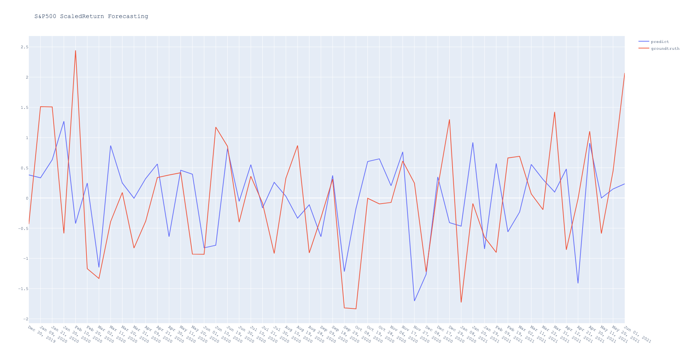

Stock price S&P500 index is examined in this project. Before running or training the model, you need to collect the S&P500 data. In this repo, I provide a small tool for crawling the data from [Yahoo](https://finance.yahoo.com/quote/%5EGSPC/history?period1=1136073600&period2=1624665600&interval=1d&filter=history&frequency=1d&includeAdjustedClose=true) using Selenium and Beautiful Soup. Once success, the data will be located in folder "data/".

1. Setup the environment with required packages and libraries using environment.yml (for running and training on CPU):
   ```
   conda update conda
   conda env create -f environment.yml
   ```
   If you aim to run or train the model on GPU then you need to install torch library with CUDA support. You need to find an appropriate version of torch library on [https://pytorch.org/get-started/previous-versions/] to your local CUDA version.
3. Prepare S&P500 data:
   ```
   cd utils
   python data_crawler.py
   cd ..
   ```
   It needs time to download on the data. When finish, a successful message will be displayed.
4. Run the pretrained forecaster:
   ```
   python main.py
   ```
   In the case where you need to train it again, you can modify the configuration file in the folder "configs/" and run the command above with flag ```--train```.
6. Result:
   
   Instead of forecasting the open/close/volume/volatility of the stock index directly, I forecasted the scaled return price by applying Exponential Weighted Moving Average technique due to the fact that older observations should be given lower weights.
